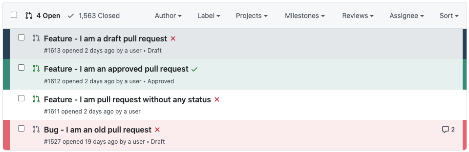
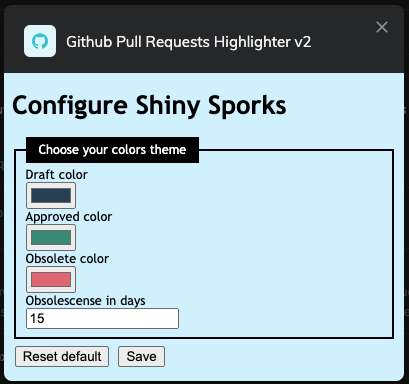

# What is Shiny Sporks doing ?

This extension intends to enhance the Github pull requests' page, by :
- adding colors to the draft and approved pull requests (list is still a work in progress)
- adding colors to the obsolete pull requests (default is 15 days old)

It has a settings page which allows to customize the default colors

# What will Shiny Sporks do in the future ?

Better support for Firefox (storage features may have introduced bugs)

Still working on :
- custom colors by pull request names (RELEASE, BUGFIX etc.)
- allowing custom selectors (probably mostly in pull requests' name)

# Instructions

Once you've cloned the repo on your computer (the extension is not yet published) :
 - Go to :
   - [**Chrome/Brave**] *chrome://extensions/*
   - [**Firefox**] *about:addons*
 - Activate "**developer mode**"
 - Click on "**load unpacked extension**" and find the extension's folder
 - Then, go on the Pull Requests URL of any repository eg. *https://github.com/floragc-octo/shiny-spork/pulls*
